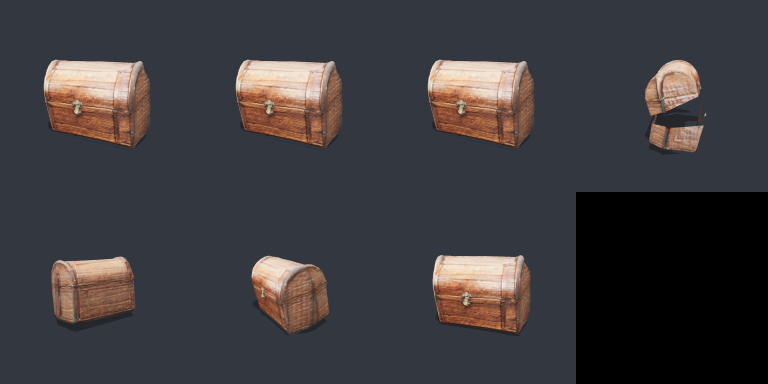

# Field report: one full abstract3d → MeshVault pipeline run (backlog 053)

Runs `20260711_234037` (first execution) and `run_chest_v2` (after the
fresh-agent gauntlet's corrections) — the end-to-end chain from a text
prompt, via `examples/t23d_pipeline.py` (the library-shaped script; the agent
recipe is `examples/t23d_pipeline.md`). A separate FRESH agent also executed
the recipe doc unaided and produced the same artifact chain; its 7 doc-defect
findings (and 6 doc-vs-script disagreements) were folded back into both files
— the most consequential: `explode_view` separation verdicts were meaningless
on parented parts (engine fixed: model-scoped boxes + hierarchy-aware world
targets), reload verification needed `pause_animation` + `set_animation_time`
(the imported clip autoplays and `seek_timeline` doesn't drive it), and the
chest-lid cut default was a mislabeled guess (the real seam measures ~43-45%
of height, not 62% — now a documented class prior with pick-first guidance).



*(intake · articulated · four timeline frames with the lid opening while the
chest turns · reloaded export)*

## The run

- **Prompt**: "a wooden treasure chest with a curved lid"
- **Generation**: `abstract3d t23d`, TripoSR backend, `mps`, composed image via
  mlx-gen `flux.2-klein-4b-8bit` (the machine's OpenAI-compatible default was
  misconfigured — 401 — so the local proof-lane provider was passed
  explicitly; first judgment point, an environment one). Wall: ~2.5 min.
  Bundle: watertight, 69,668 vertices, 2048² baked basecolor, `uv_present`.
- **Pipeline** (MeshVault stages): **53.5 s** total on SwiftShader — v2 run
  wall times throughout this table (the pre-fix first run measured 28.9 s;
  its verdicts remain in `run_chest/` for comparison).

| stage | wall (v2) | decision (from numbers) | outcome |
|-------|-----------|--------------------------|---------|
| intake | 16.0 s | never mutates | 131,376 tris, 1 mesh, openEdges 0, degenerate 0, issues [] |
| repair | 0.3 s | fix_mesh always runs (cheap) | **honest no-op** — all deltas 0 (TripoSR `cleanup=presentation` had already repaired) |
| optimize | 2.0 s | 131,376 ≤ budget 150,000 | **honest no-op** — survey table recorded; marching-cubes density is uniform (median 49,712 tri/unit²; over-budget UNIFORM meshes now route to global simplify instead of stalling) |
| texture | 0.2 s | inspection-first; no visual defect identified | report: 2048² sRGB, texel density p5 753 / median 974 / p95 1155, **65 UV islands** (fragmented — UV surgery would be the wrong repair class if one were needed) |
| articulate | 1.7 s | detect_parts found **1 fused component** (the TripoSR norm) → plane cut | cut y at 45% of height (the measured-seam class prior), hinge pivot at the back edge; `openEdgesAdded` 549 (hollow cut faces, documented); explode_view BEFORE parenting: `minGapWorld` **+1.408** (clean numeric separation — the v1 run's negative value was the parented-explode engine bug, since fixed) |
| animate | 18.9 s | lid sweep −25° (≤30° hollow-face budget) + turntable keyed 0/90/180/270/360 | 2 tracks, 4 s timeline; 4 deterministic seek renders (fixed camera) |
| export | 11.4 s | reload-verification is destructive → last | 7.29 MB GLB; **clipsAfterReload = 1**, triangles conserved (131,376) |

Full numbers: `~/MeshVault_assets/proofs/t23d_pipeline/run_chest_v2/verdicts.json`
(out-of-repo proof pack with all renders + `final_animated.glb` + `INDEX.md`;
GLBs and full-size renders are artifacts, not source — 047 convention;
`run_chest/` keeps the uncorrected first run for comparison).

## Judgment vs automation (what blackpixel would need to supply)

1. **Environment resolution** (once per machine): which image provider backs
   t23d. Automated detection is possible (the 401 is loud); the script fails
   with the provider hint.
2. **The hinge**: the ONLY per-asset judgment in this run. The script exposes
   it as `--cut-axis/--cut-at-frac` (default = chest/box-lid class); an agent
   reads it off a screenshot + `pick` on the lid seam. Everything else —
   repair gates, density gates, part-size gates, sweep budget, keyframe
   waypoints — ran from tool returns alone.
3. **Prompt class**: single object with a plane-cuttable hinge line makes the
   articulation stage meaningful. That is authoring guidance, not a pipeline
   parameter.

## Honest findings

- The **expected shape declared before the run held**: repair no-op,
  optimize no-op (this asset is *at* the web budget and uniformly dense — the
  gate correctly refused to invent work), articulation real (fused component
  → plane cut), animation real, round-trip verified.
- The fresh-agent gauntlet measured the real lid seam at **43.3%** of height
  via pick (the shadow groove under the lid's rim) where the script's naive
  default said 62% — the strongest evidence in this exercise that hinge
  placement is agent judgment, not a constant. The default is now 45% and
  labeled as a class prior.
- The optimize gate combination had a hole the gauntlet exposed: over-budget
  + UNIFORM density (the marching-cubes norm) satisfied neither branch and
  left oversized assets untouched. The table now routes that case to GLOBAL
  `simplify` (regional surgery is only for differential density).
- The cut faces are hollow (visible when the lid opens past ~25° at grazing
  angles) — the documented 051 limitation; the sweep budget keeps it
  presentable. The pale interior/back texture is TripoSR single-view
  projection coverage (~0.26), an asset property.
- `sample_points`-based chamfer verification never ran because optimize was a
  no-op — by design, the check only accompanies an actual mutation.

## Reproduce

```bash
# with an existing bundle (no GPU work):
poetry run python examples/t23d_pipeline.py --bundle <bundle_dir>

# full chain (negotiates the GPU; TripoSR-only):
poetry run python examples/t23d_pipeline.py "a wooden treasure chest with a curved lid"
```
